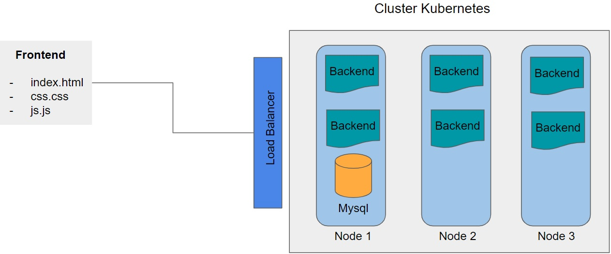
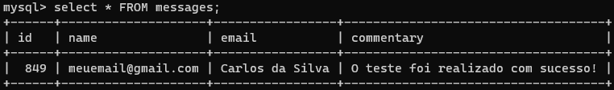

# Application deploy

### Introduction

---

In this project, a complete application will be deployed with frontend, backend and mysql database. In the development of the project, the images of the containers and services needed in Kubernetes will be created so that the application is ready for production.

### Tools

---

* Docker / Dockerfile
* Kubernetes
* Cloud GCP
* Powershell

## Deployment

To deploy the project, run the `script.sh` file.

This script will build Docker images for the frontend, backend and database, push them to Docker Hub, create services in the Kubernetes cluster, and execute the deployment.

The `deployment.yml` file contains the configuration for the MySQL database and the PHP application. The `services.yml` file creates services for the PHP application and the MySQL database.

## Notes

- The Docker images are pushed to Docker Hub with the name `burntroll/backend-project:1.0` for the PHP application and `burntroll/database:1.0` for the MySQL database.
- The deployment configuration includes six replicas for the PHP application.
- The MySQL database uses a persistent volume claim with a storage class of `standard-rwo` and a capacity of 10Gi.
- The PHP application is exposed as a load balancer service on port 80.
- The MySQL database is not exposed to the public and can only be accessed by the PHP application.

### Application Architecture

---

### Results

---

Inserting information into the application

Checking data in the database

